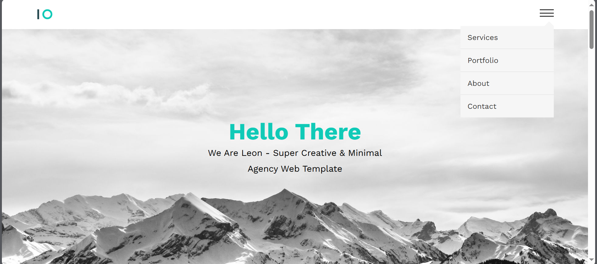
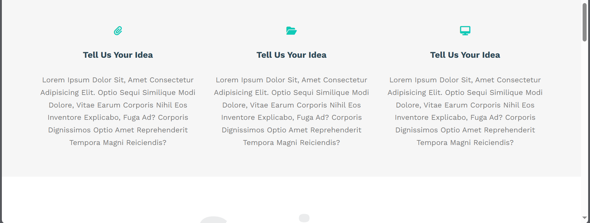
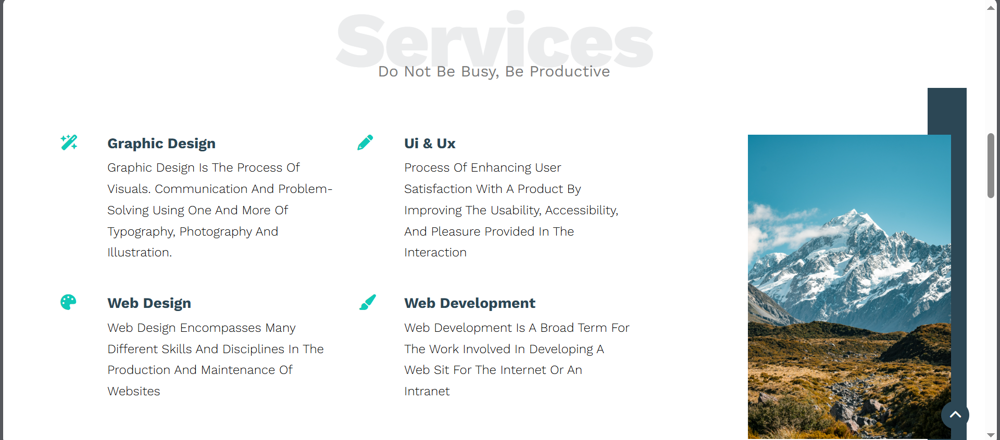
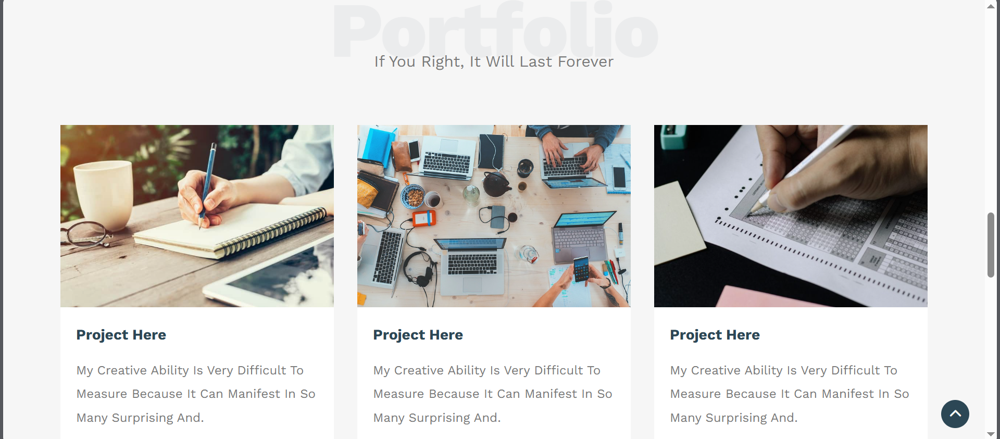
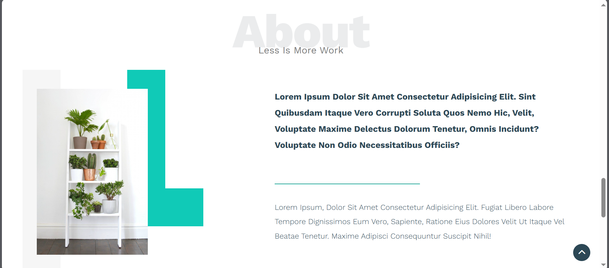
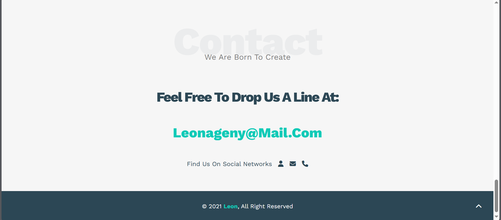

# Leon Template

## What did i use to create this template?

I used Html, css, fontawesome, and javascript.

## About Me

I'm Ahmed Magdy I'm Fronend Developer.

### Landing Page:

### Next Section

### Services Section

### Portfolio

### About Section

### Contact And Footer

## Links

- Facebook
  https://www.facebook.com/profile.php?id=100085749470017

- X
  https://twitter.com/ahmed_magdy135
